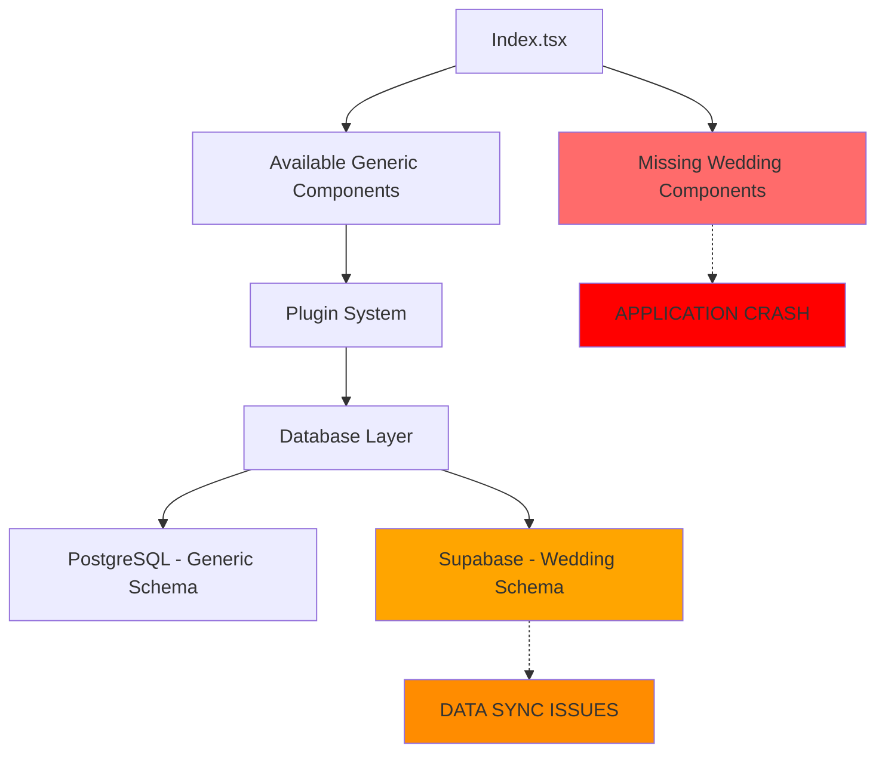

# ANALYSIS RESULT BY CODE - Event Management Engine Transformation

**Project**: Wedding Invite → Generic Multi-Event Platform (EMESYS)  
**Analysis Date**: 14 Agustus 2025  
**Analysis Type**: Comprehensive Code Review  
**Status**: HYBRID TRANSFORMATION IN PROGRESS

---

## 🚨 EXECUTIVE SUMMARY

Project "weddinvite" sedang dalam **TRANSFORMASI BESAR** dari Wedding Invitation App menjadi **Generic Multi-Event Platform** (Event Management Engine). Status saat ini adalah **HYBRID ARCHITECTURE** dengan risiko tinggi karena ada **MISSING COMPONENTS** yang dapat menyebabkan aplikasi crash.

### ⚠️ CRITICAL ISSUES IDENTIFIED

1. **BROKEN FRONTEND**: Missing wedding-specific components di `Index.tsx`
2. **DATABASE INCONSISTENCY**: Triple database architecture dengan schema yang tidak sinkron
3. **INCOMPLETE TRANSFORMATION**: Beberapa layer sudah generic, beberapa masih wedding-specific

---

## 📋 DETAILED TECHNICAL ANALYSIS

### 1. FRONTEND COMPONENT ARCHITECTURE

#### ✅ **KOMPONEN YANG ADA (Generic)**
```typescript
// src/components/ - WORKING COMPONENTS
- EventDetails.tsx     // ✅ Generic dengan eventType parameter
- EventHero.tsx        // ✅ Generic dengan eventType parameter  
- ParticipantsSection.tsx // ✅ Generic dengan eventType parameter
- Navigation.tsx       // ✅ Working
- Footer.tsx          // ✅ Working
- RSVPSection.tsx     // ✅ Working
- ThemeWrapper.tsx    // ✅ Working
- AuthProvider.tsx    // ✅ Working
```

#### ❌ **KOMPONEN YANG MISSING (Wedding-Specific)**
```typescript
// src/pages/Index.tsx - BROKEN IMPORTS
import { WeddingHero } from '@/components/WeddingHero';         // ❌ FILE NOT FOUND
import { CoupleSection } from '@/components/CoupleSection';     // ❌ FILE NOT FOUND
import { LoveStorySection } from '@/components/LoveStorySection'; // ❌ FILE NOT FOUND
import { WeddingDetails } from '@/components/WeddingDetails';   // ❌ FILE NOT FOUND
```

**IMPACT**: Aplikasi akan CRASH saat di-load karena komponen tidak ditemukan.

#### 🔧 **SOLUTION PATH**
Komponen generic sudah siap digunakan:
```typescript
// WORKING ALTERNATIVES ALREADY EXIST
<EventHero eventType="wedding" />        // ✅ Replaces WeddingHero
<ParticipantsSection eventType="wedding" /> // ✅ Can replace CoupleSection
<EventDetails eventType="wedding" />     // ✅ Replaces WeddingDetails
// LoveStorySection perlu implementasi baru atau mapping ke EventDetails
```

---

### 2. DATABASE ARCHITECTURE ANALYSIS

#### 🏗️ **TRIPLE DATABASE LAYER**

**A. PostgreSQL (Local) - GENERIC ARCHITECTURE**
```sql
-- ✅ TRANSFORMATION COMPLETED
- event_types          // ✅ Generic event type system
- events              // ✅ Generic events table with JSONB flexibility
- event_participants  // ✅ Generic participants system
- event_sections      // ✅ Generic sections system
- event_templates     // ✅ Generic templates system
- tenants            // ✅ Multi-tenant support
```

**B. Supabase (Cloud) - WEDDING-SPECIFIC**
```sql
-- ❌ LEGACY SCHEMA - NOT SYNCHRONIZED
CREATE TABLE wedding_events (
  event_type VARCHAR(20) CHECK (event_type IN ('akad', 'resepsi', 'other'))
  // Still hardcoded to wedding events
);
```

**C. Mock Database (Testing) - HYBRID**
```typescript
// Connection layer sudah generic tapi data masih mixed
- connection.ts        // ✅ Generic connection
- smart-connection.ts  // ✅ Generic smart routing  
- connection-mock.ts   // ✅ Generic mock system
```

#### 📊 **DATABASE MIGRATION STATUS**

| Migration | Status | Impact |
|-----------|--------|---------|
| `001_tenants_core` | ✅ Completed | Multi-tenant foundation |
| `002_event_types_registry` | ✅ Completed | Generic event types |
| `007_events_core_tables` | ✅ Completed | Main generic tables |
| `009_wedding_compatibility` | ✅ Completed | Backward compatibility views |
| **Supabase Schema** | ❌ **OUT OF SYNC** | Cloud database still wedding-only |

**CRITICAL**: Supabase masih menggunakan `wedding_events` table yang tidak kompatibel dengan generic `events` table.

---

### 3. PLUGIN SYSTEM ARCHITECTURE

#### ✅ **PLUGIN SYSTEM STATUS: EXCELLENT**

**A. Core Plugin Infrastructure**
```typescript
// src/plugins/ - FULLY IMPLEMENTED
- types.ts           // ✅ Comprehensive type definitions
- registry.ts        // ✅ Full plugin registry with lifecycle management
- hooks.ts          // ✅ Complete hook system for plugin integration
- index.ts          // ✅ Plugin system initialization
```

**B. Wedding Plugin Implementation**
```typescript
// src/plugins/wedding/WeddingPlugin.tsx - REFERENCE IMPLEMENTATION
export const WeddingPlugin: EventPlugin = {
  type: 'wedding',
  renderHero: (data, config) => <EventHero eventType="wedding" />,
  renderParticipants: (data, config) => <ParticipantsSection eventType="wedding" />,
  renderDetails: (data, config) => <EventDetails eventType="wedding" />,
  // Lengkap dengan validation, themes, lifecycle hooks
};
```

**ASSESSMENT**: Plugin system sudah matang dan siap untuk multi-event expansion.

---

### 4. AUTHENTICATION & SECURITY

#### ✅ **AUTH IMPLEMENTATION STATUS**
```typescript
// src/components/AuthProvider.tsx - WORKING
- Multi-tenant authentication support
- Session management
- User context provider

// Database level security
- Row Level Security (RLS) implemented
- Tenant-based access control
- Role-based permissions system
```

---

### 5. TESTING FRAMEWORK

#### ✅ **COMPREHENSIVE TEST COVERAGE**
```javascript
// __tests__/ directory structure
- global-test-runner.cjs                    // ✅ Test orchestration
- database/performance-tests/               // ✅ Performance testing
- database/validation-tests/                // ✅ Data validation testing  
- database/security/roles-permissions.test.ts // ✅ Security testing
- database/integration/realtime-crud.test.ts  // ✅ Integration testing
```

---

## 🔍 INCONSISTENCY ANALYSIS

### **ARCHITECTURAL INCONSISTENCIES**

| Layer | Status | Issues |
|-------|--------|--------|
| **Frontend Components** | 🟡 Mixed | Generic components exist, but Index.tsx uses missing wedding-specific imports |
| **Database Schema** | 🔴 Inconsistent | PostgreSQL generic, Supabase still wedding-specific |
| **Plugin System** | 🟢 Consistent | Fully generic and extensible |
| **Authentication** | 🟢 Consistent | Multi-tenant ready |
| **Testing** | 🟢 Consistent | Comprehensive coverage for all layers |

### **DATA FLOW INCONSISTENCIES**



---

## 🎯 TRANSFORMATION ROADMAP

### **CURRENT STATE**: Hybrid Architecture (60% Transformed)

#### ✅ **COMPLETED TRANSFORMATIONS**
1. **Database Core**: Generic events, participants, sections tables
2. **Plugin Architecture**: Complete plugin system with registry
3. **Authentication**: Multi-tenant ready
4. **Testing Framework**: Comprehensive test coverage
5. **Component Library**: Generic components with eventType parameter

#### 🚧 **IN-PROGRESS TRANSFORMATIONS**
1. **Frontend Integration**: Generic components exist but not properly wired
2. **Migration System**: PostgreSQL complete, Supabase pending

#### ❌ **PENDING TRANSFORMATIONS**  
1. **Frontend Routing**: Index.tsx still hardcoded to missing wedding components
2. **Supabase Schema Sync**: Cloud database still wedding-specific
3. **Data Migration**: Existing wedding data not migrated to generic schema
4. **Documentation**: API documentation not updated for generic system

---

## 🚨 RISK ASSESSMENT

### **HIGH RISK ITEMS**

| Risk | Impact | Likelihood | Mitigation Required |
|------|--------|------------|-------------------|
| **Application Crash** | 🔴 Critical | 🔴 High | Fix missing component imports immediately |
| **Data Loss** | 🔴 Critical | 🟡 Medium | Sync database schemas and migrate data |
| **Development Confusion** | 🟡 Medium | 🔴 High | Complete documentation and clear architecture |

### **IMMEDIATE ACTIONS REQUIRED**

1. **FIX BROKEN IMPORTS** - Replace missing wedding components with generic alternatives
2. **SYNC DATABASE SCHEMAS** - Migrate Supabase to generic schema
3. **COMPLETE TRANSFORMATION** - Finish remaining architectural updates

---

## 📈 PROJECT HEALTH METRICS

### **Code Quality Assessment**

| Metric | Score | Notes |
|--------|-------|-------|
| **Architecture Consistency** | 6/10 | Mixed wedding-specific and generic patterns |
| **Component Reusability** | 8/10 | Generic components well-designed |
| **Database Design** | 7/10 | Generic schema good, but inconsistent across layers |
| **Plugin Extensibility** | 9/10 | Excellent plugin architecture |
| **Test Coverage** | 9/10 | Comprehensive testing framework |
| **Documentation** | 3/10 | Outdated and incomplete |

### **Technical Debt Analysis**

```typescript
// HIGH PRIORITY TECHNICAL DEBT
1. Missing component implementations (BLOCKS FUNCTIONALITY)
2. Database schema inconsistencies (BLOCKS DATA FLOW) 
3. Hardcoded wedding references in generic system (BLOCKS EXTENSIBILITY)

// MEDIUM PRIORITY TECHNICAL DEBT  
4. Outdated documentation (BLOCKS DEVELOPMENT)
5. Incomplete migration scripts (BLOCKS DEPLOYMENT)
6. Mixed naming conventions (BLOCKS MAINTAINABILITY)
```

---

## 🔧 RECOMMENDED IMPLEMENTATION PLAN

### **PHASE 1: STABILIZATION (URGENT)**
- [ ] Fix missing component imports in Index.tsx
- [ ] Create component mapping between wedding-specific and generic
- [ ] Test application functionality after fixes

### **PHASE 2: DATABASE SYNCHRONIZATION**
- [ ] Design Supabase migration to generic schema
- [ ] Create data migration scripts for existing wedding data
- [ ] Implement database sync validation tests

### **PHASE 3: COMPLETE TRANSFORMATION**
- [ ] Remove all hardcoded wedding references
- [ ] Implement remaining generic components
- [ ] Update all documentation and API references

### **PHASE 4: ENHANCEMENT & EXPANSION**  
- [ ] Add new event type plugins (conference, birthday, corporate)
- [ ] Implement advanced multi-tenant features
- [ ] Performance optimization and scaling preparation

---

## 📝 CONCLUSIONS

Project "weddinvite" menunjukkan **transformasi ambisius** yang sudah 60% selesai dengan fondasi yang solid:

### **STRENGTHS**
- Plugin architecture yang excellent dan ekstensible
- Database design generic yang komprehensif  
- Testing framework yang matang
- Authentication system yang siap multi-tenant

### **CRITICAL ISSUES**
- Frontend masih menggunakan komponen yang tidak ada
- Database layer tidak sinkron antara PostgreSQL dan Supabase
- Dokumentasi tidak up-to-date dengan arsitektur baru

### **NEXT STEPS**
1. **IMMEDIATE**: Fix broken component imports untuk stabilkan aplikasi
2. **SHORT-TERM**: Sync database schemas dan migrate existing data
3. **LONG-TERM**: Complete transformation dan expand ke event types lain

**STATUS**: Project ini memiliki potensi besar tapi memerlukan fokus pada menyelesaikan transformasi yang sudah dimulai sebelum menambah fitur baru.

---

*Analysis completed by: Kilo Code - Technical Architect*  
*Date: 14 Agustus 2025*