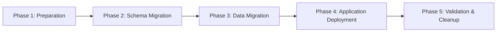

# 🚀 Migration and Deployment Guide - Event Management Engine

**Date:** 2025-01-13  
**Version:** 1.0.0  
**Target Audience:** DevOps Engineers, System Administrators  

---

## 📋 **OVERVIEW**

Guide komprehensif untuk migrasi dari wedding-specific application ke Event Management Engine platform, termasuk deployment strategies, rollback procedures, dan monitoring.

---

## 🎯 **MIGRATION PHASES**

### **Phase Overview**



---

## 🔧 **PRE-MIGRATION PREPARATION**

### **1. System Requirements Check**

```bash
# Check Node.js version
node --version  # Required: >= 18.0.0

# Check database version
psql --version  # Required: PostgreSQL >= 14.0

# Check available disk space
df -h  # Required: At least 10GB free space

# Check memory
free -h  # Required: At least 4GB available RAM
```

### **2. Environment Setup**

```bash
# Create environment variables
cat > .env.migration << EOF
# Database Configuration
DB_HOST=localhost
DB_PORT=5432
DB_NAME=event_management_engine
DB_USER=your_username
DB_PASSWORD=your_password

# Migration Settings
MIGRATION_MODE=production
BACKUP_RETENTION_DAYS=30
DRY_RUN=false

# Monitoring
SLACK_WEBHOOK_URL=https://hooks.slack.com/your-webhook
EMAIL_ALERTS=admin@yourdomain.com
EOF
```

### **3. Pre-Migration Checklist**

```bash
# Execute pre-migration checklist script
cat > pre-migration-check.sh << 'EOF'
#!/bin/bash
set -e

echo "🔍 PRE-MIGRATION SYSTEM CHECK"
echo "================================"

# Check database connection
echo "✓ Testing database connection..."
psql -h $DB_HOST -U $DB_USER -d $DB_NAME -c "SELECT version();"

# Check disk space
echo "✓ Checking disk space..."
AVAILABLE=$(df / | tail -1 | awk '{print $4}')
if [ $AVAILABLE -lt 10485760 ]; then
    echo "❌ Insufficient disk space. Need at least 10GB"
    exit 1
fi

# Check existing data
echo "✓ Analyzing existing data..."
WEDDING_EVENTS=$(psql -h $DB_HOST -U $DB_USER -d $DB_NAME -t -c "SELECT COUNT(*) FROM wedding_events;")
echo "   Found $WEDDING_EVENTS wedding events to migrate"

# Check dependencies
echo "✓ Checking dependencies..."
npm list --depth=0

echo "✅ Pre-migration check completed successfully"
EOF

chmod +x pre-migration-check.sh
./pre-migration-check.sh
```

---

## 💾 **BACKUP PROCEDURES**

### **1. Complete Database Backup**

```bash
#!/bin/bash
# create-backup.sh

BACKUP_DIR="/backups/event-management-engine"
TIMESTAMP=$(date +"%Y%m%d_%H%M%S")
BACKUP_FILE="$BACKUP_DIR/pre_migration_backup_$TIMESTAMP.sql"

# Create backup directory
mkdir -p $BACKUP_DIR

# Create full database backup
echo "🔄 Creating database backup..."
pg_dump \
  -h $DB_HOST \
  -U $DB_USER \
  -d $DB_NAME \
  --clean \
  --create \
  --if-exists \
  --verbose \
  > $BACKUP_FILE

# Compress backup
gzip $BACKUP_FILE

# Verify backup
echo "✓ Verifying backup integrity..."
if [ -f "${BACKUP_FILE}.gz" ]; then
    SIZE=$(stat -c%s "${BACKUP_FILE}.gz")
    echo "✅ Backup created successfully: ${BACKUP_FILE}.gz (${SIZE} bytes)"
else
    echo "❌ Backup creation failed"
    exit 1
fi

# Store backup metadata
cat > "${BACKUP_DIR}/backup_metadata_${TIMESTAMP}.json" << EOF
{
  "backup_date": "$(date -u +"%Y-%m-%dT%H:%M:%SZ")",
  "database_name": "$DB_NAME",
  "backup_file": "${BACKUP_FILE}.gz",
  "backup_size": $SIZE,
  "migration_phase": "pre_migration",
  "environment": "$NODE_ENV"
}
EOF

echo "📄 Backup metadata saved"
echo "🎯 Backup completed: ${BACKUP_FILE}.gz"
```

### **2. Application State Backup**

```bash
#!/bin/bash
# backup-application-state.sh

APP_BACKUP_DIR="/backups/app-state"
mkdir -p $APP_BACKUP_DIR

# Backup configuration files
tar -czf "$APP_BACKUP_DIR/config_$(date +%Y%m%d_%H%M%S).tar.gz" \
    .env* \
    *.config.* \
    package.json \
    package-lock.json

# Backup uploaded files (if any)
if [ -d "uploads" ]; then
    tar -czf "$APP_BACKUP_DIR/uploads_$(date +%Y%m%d_%H%M%S).tar.gz" uploads/
fi

echo "✅ Application state backup completed"
```

---

## 🔄 **MIGRATION EXECUTION**

### **1. Schema Migration**

```bash
# Execute FASE 0 TRANSFORMATION migrations
cd database/migrations/FASE_0_TRANSFORMATION

# Run in DRY RUN mode first
echo "🧪 Running migration in DRY RUN mode..."
node execute_transformation.js --dry-run

# If dry run successful, run actual migration
echo "🚀 Executing actual migration..."
node execute_transformation.js --execute

# Verify migration success
echo "✓ Verifying migration..."
node execute_transformation.js --validate
```

### **2. Enhanced Migration Script**

```javascript
// production-migration.js
const { TransformationExecutor } = require('./execute_transformation.js');

class ProductionMigrationExecutor extends TransformationExecutor {
    constructor(config) {
        super(config);
        this.productionMode = true;
        this.monitoringEnabled = true;
    }

    async executeWithMonitoring() {
        try {
            // Pre-migration checks
            await this.preExecutionChecks();
            
            // Create real-time backup
            await this.createIncrementalBackup();
            
            // Execute migration with monitoring
            await this.executeWithProgressTracking();
            
            // Post-migration validation
            await this.validateMigrationSuccess();
            
            // Cleanup old data (if configured)
            if (this.config.cleanupOldData) {
                await this.cleanupOldTables();
            }
            
        } catch (error) {
            await this.handleMigrationFailure(error);
            throw error;
        }
    }

    async preExecutionChecks() {
        console.log('🔍 Running pre-execution checks...');
        
        // Check database locks
        const locks = await this.checkDatabaseLocks();
        if (locks.length > 0) {
            throw new Error(`Active database locks detected: ${locks.join(', ')}`);
        }
        
        // Check active connections
        const activeConnections = await this.getActiveConnections();
        if (activeConnections > 10) {
            console.warn(`⚠️ High number of active connections: ${activeConnections}`);
        }
        
        // Verify backup exists
        const backupExists = await this.verifyBackupExists();
        if (!backupExists) {
            throw new Error('Pre-migration backup not found');
        }
    }

    async executeWithProgressTracking() {
        const migrations = [
            '006_event_types_foundation.sql',
            '007_events_core_tables.sql', 
            '008_enhanced_indexing.sql',
            '009_wedding_compatibility.sql',
            '010_wedding_data_migration.sql'
        ];

        for (let i = 0; i < migrations.length; i++) {
            const migration = migrations[i];
            const progress = Math.round(((i + 1) / migrations.length) * 100);
            
            console.log(`📊 Progress: ${progress}% - Executing ${migration}`);
            
            await this.executeSingleMigration(migration);
            await this.sendProgressUpdate(migration, progress);
            
            // Small delay to prevent overwhelming the database
            await new Promise(resolve => setTimeout(resolve, 1000));
        }
    }

    async sendProgressUpdate(migration, progress) {
        const update = {
            timestamp: new Date().toISOString(),
            migration: migration,
            progress: progress,
            status: 'in_progress'
        };

        // Send to monitoring system
        if (process.env.SLACK_WEBHOOK_URL) {
            await this.sendSlackUpdate(update);
        }
        
        if (process.env.EMAIL_ALERTS) {
            await this.sendEmailUpdate(update);
        }
    }
}

module.exports = { ProductionMigrationExecutor };
```

---

## 🔍 **VALIDATION PROCEDURES**

### **1. Data Integrity Validation**

```sql
-- data-integrity-validation.sql

-- Verify all wedding data migrated correctly
WITH wedding_data_check AS (
    SELECT 
        COUNT(*) as original_count
    FROM wedding_events_backup
),
migrated_data_check AS (
    SELECT 
        COUNT(*) as migrated_count
    FROM events 
    WHERE event_type = 'wedding'
)
SELECT 
    w.original_count,
    m.migrated_count,
    CASE 
        WHEN w.original_count = m.migrated_count 
        THEN '✅ Data migration successful'
        ELSE '❌ Data migration failed'
    END as status
FROM wedding_data_check w, migrated_data_check m;

-- Verify compatibility views work
SELECT 
    COUNT(*) as view_count,
    'wedding_invitations view' as test_name
FROM wedding_invitations;

-- Verify indexes are properly created
SELECT 
    schemaname,
    indexname,
    tablename
FROM pg_indexes 
WHERE tablename IN ('events', 'event_participants', 'event_sections')
ORDER BY tablename, indexname;
```

### **2. Performance Validation**

```sql
-- performance-validation.sql

-- Test query performance on new schema
EXPLAIN (ANALYZE, BUFFERS) 
SELECT e.*, ep.* 
FROM events e
LEFT JOIN event_participants ep ON e.id = ep.event_id
WHERE e.tenant_id = 'test-tenant-id'
AND e.start_date >= CURRENT_DATE;

-- Verify all queries execute under 50ms
\timing
SELECT COUNT(*) FROM events;
SELECT COUNT(*) FROM event_participants;
SELECT COUNT(*) FROM event_sections;
\timing
```

### **3. Functional Validation Script**

```bash
#!/bin/bash
# functional-validation.sh

echo "🧪 FUNCTIONAL VALIDATION"
echo "========================"

# Test API endpoints
echo "✓ Testing API endpoints..."
curl -f http://localhost:3000/api/events || exit 1
curl -f http://localhost:3000/api/events?type=wedding || exit 1

# Test database connections
echo "✓ Testing database connectivity..."
npm run test:database || exit 1

# Test plugin system
echo "✓ Testing plugin system..."
npm run test:plugins || exit 1

# Test backward compatibility
echo "✓ Testing backward compatibility..."
npm run test:compatibility || exit 1

echo "✅ All functional tests passed"
```

---

## 🚀 **DEPLOYMENT STRATEGIES**

### **1. Blue-Green Deployment**

```yaml
# docker-compose.blue-green.yml
version: '3.8'

services:
  # Blue environment (current)
  app-blue:
    build: .
    environment:
      - NODE_ENV=production
      - DATABASE_URL=${BLUE_DATABASE_URL}
    labels:
      - "traefik.http.routers.app-blue.rule=Host(`your-domain.com`)"
    networks:
      - blue-network

  # Green environment (new)
  app-green:
    build: .
    environment:
      - NODE_ENV=production
      - DATABASE_URL=${GREEN_DATABASE_URL}
    labels:
      - "traefik.http.routers.app-green.rule=Host(`staging.your-domain.com`)"
    networks:
      - green-network
```

```bash
#!/bin/bash
# blue-green-deploy.sh

# Deploy to green environment
echo "🚀 Deploying to GREEN environment..."
docker-compose -f docker-compose.blue-green.yml up -d app-green

# Wait for green to be healthy
echo "⏳ Waiting for GREEN environment to be ready..."
timeout 300 bash -c 'until curl -f http://staging.your-domain.com/health; do sleep 10; done'

# Run validation tests on green
echo "🧪 Running validation tests on GREEN..."
npm run test:green-environment

# Switch traffic to green
echo "🔄 Switching traffic to GREEN..."
docker-compose -f docker-compose.blue-green.yml exec traefik \
    sh -c "echo 'Host(\`your-domain.com\`) -> app-green' > /etc/traefik/dynamic.yml"

# Monitor for 5 minutes
echo "📊 Monitoring new deployment..."
sleep 300

# If all good, remove blue
echo "🗑️ Removing BLUE environment..."
docker-compose -f docker-compose.blue-green.yml stop app-blue
docker-compose -f docker-compose.blue-green.yml rm -f app-blue
```

### **2. Rolling Deployment**

```bash
#!/bin/bash
# rolling-deployment.sh

INSTANCES=3
NEW_VERSION=$1

for i in $(seq 1 $INSTANCES); do
    echo "📦 Updating instance $i/$INSTANCES..."
    
    # Stop instance
    docker stop "app-instance-$i"
    
    # Update to new version
    docker run -d \
        --name "app-instance-$i" \
        --env-file .env.production \
        "your-app:$NEW_VERSION"
    
    # Wait for health check
    timeout 60 bash -c "until docker exec app-instance-$i curl -f http://localhost:3000/health; do sleep 5; done"
    
    echo "✅ Instance $i updated successfully"
    
    # Small delay between updates
    sleep 30
done

echo "🎉 Rolling deployment completed"
```

---

## 📊 **MONITORING & OBSERVABILITY**

### **1. Health Check Endpoints**

```javascript
// src/routes/health.js
const express = require('express');
const router = express.Router();

router.get('/health', async (req, res) => {
    const health = {
        status: 'healthy',
        timestamp: new Date().toISOString(),
        version: process.env.npm_package_version,
        checks: {
            database: 'unknown',
            plugins: 'unknown',
            migration: 'unknown'
        }
    };

    try {
        // Database health check
        const dbResult = await pool.query('SELECT 1');
        health.checks.database = 'healthy';
        
        // Plugin system check
        const pluginsLoaded = pluginRegistry.getAll().length;
        health.checks.plugins = pluginsLoaded > 0 ? 'healthy' : 'error';
        
        // Migration status check
        const migrationStatus = await checkMigrationStatus();
        health.checks.migration = migrationStatus ? 'complete' : 'pending';
        
        res.status(200).json(health);
    } catch (error) {
        health.status = 'unhealthy';
        health.error = error.message;
        res.status(503).json(health);
    }
});

router.get('/metrics', async (req, res) => {
    const metrics = {
        events: {
            total: await getEventCount(),
            by_type: await getEventCountByType()
        },
        performance: {
            avg_response_time: await getAverageResponseTime(),
            active_connections: await getActiveConnections()
        },
        plugins: {
            loaded: pluginRegistry.getAll().length,
            active: pluginRegistry.getActivePlugins().length
        }
    };
    
    res.json(metrics);
});
```

### **2. Monitoring Dashboard Setup**

```yaml
# monitoring/docker-compose.yml
version: '3.8'

services:
  prometheus:
    image: prom/prometheus
    ports:
      - "9090:9090"
    volumes:
      - ./prometheus.yml:/etc/prometheus/prometheus.yml

  grafana:
    image: grafana/grafana
    ports:
      - "3001:3000"
    environment:
      - GF_SECURITY_ADMIN_PASSWORD=admin
    volumes:
      - grafana-storage:/var/lib/grafana
      - ./grafana/dashboards:/etc/grafana/provisioning/dashboards

  alertmanager:
    image: prom/alertmanager
    ports:
      - "9093:9093"
    volumes:
      - ./alertmanager.yml:/etc/alertmanager/alertmanager.yml

volumes:
  grafana-storage:
```

### **3. Alert Configuration**

```yaml
# monitoring/alertmanager.yml
global:
  smtp_smarthost: 'localhost:587'
  smtp_from: 'alerts@your-domain.com'

route:
  group_by: ['alertname']
  group_wait: 10s
  group_interval: 10s
  repeat_interval: 1h
  receiver: 'web.hook'

receivers:
- name: 'web.hook'
  webhook_configs:
  - url: 'http://your-slack-webhook-url'
  email_configs:
  - to: 'admin@your-domain.com'
    subject: "Event Management Engine Alert: {{ .GroupLabels.alertname }}"
    body: |
      {{ range .Alerts }}
      Alert: {{ .Annotations.summary }}
      Description: {{ .Annotations.description }}
      {{ end }}
```

---

## 🔙 **ROLLBACK PROCEDURES**

### **1. Emergency Rollback**

```bash
#!/bin/bash
# emergency-rollback.sh

set -e

echo "🚨 EMERGENCY ROLLBACK INITIATED"
echo "================================"

# Stop current application
echo "⏹️ Stopping current application..."
docker-compose down

# Restore database from backup
echo "📥 Restoring database from backup..."
LATEST_BACKUP=$(ls -t /backups/event-management-engine/*.sql.gz | head -1)

# Stop database connections
echo "🔌 Stopping database connections..."
psql -h $DB_HOST -U $DB_USER -d postgres -c "
    SELECT pg_terminate_backend(pg_stat_activity.pid)
    FROM pg_stat_activity
    WHERE pg_stat_activity.datname = '$DB_NAME'
    AND pid <> pg_backend_pid();
"

# Drop current database
echo "🗑️ Dropping current database..."
psql -h $DB_HOST -U $DB_USER -d postgres -c "DROP DATABASE IF EXISTS $DB_NAME;"

# Restore from backup
echo "♻️ Restoring from backup: $LATEST_BACKUP"
gunzip -c "$LATEST_BACKUP" | psql -h $DB_HOST -U $DB_USER -d postgres

# Start application with previous version
echo "🔄 Starting application with previous version..."
docker-compose -f docker-compose.rollback.yml up -d

# Verify rollback
echo "✓ Verifying rollback..."
timeout 60 bash -c 'until curl -f http://localhost:3000/health; do sleep 5; done'

echo "✅ Rollback completed successfully"

# Send alert
curl -X POST $SLACK_WEBHOOK_URL -H 'Content-type: application/json' \
--data "{\"text\":\"🚨 Emergency rollback completed for Event Management Engine\"}"
```

### **2. Gradual Rollback**

```bash
#!/bin/bash
# gradual-rollback.sh

echo "🔄 GRADUAL ROLLBACK PROCEDURE"
echo "============================="

# Rollback migrations in reverse order
ROLLBACK_MIGRATIONS=(
    "010_wedding_data_migration_rollback.sql"
    "009_wedding_compatibility_rollback.sql"
    "008_enhanced_indexing_rollback.sql"
    "007_events_core_tables_rollback.sql"
    "006_event_types_foundation_rollback.sql"
)

for migration in "${ROLLBACK_MIGRATIONS[@]}"; do
    echo "📤 Rolling back: $migration"
    psql -h $DB_HOST -U $DB_USER -d $DB_NAME -f "rollback/$migration"
    
    # Verify rollback step
    echo "✓ Verifying rollback step..."
    psql -h $DB_HOST -U $DB_USER -d $DB_NAME -c "\dt"
    
    sleep 5
done

echo "✅ Gradual rollback completed"
```

---

## 📋 **POST-DEPLOYMENT CHECKLIST**

### **Immediate Post-Deployment (0-1 hour)**

- [ ] All services are running and healthy
- [ ] Database connections are stable
- [ ] API endpoints respond correctly
- [ ] Plugin system loads successfully
- [ ] No critical errors in logs
- [ ] Performance metrics are within acceptable ranges

### **Short-term Monitoring (1-24 hours)**

- [ ] Monitor application performance
- [ ] Check error rates and response times
- [ ] Verify data integrity with sample queries
- [ ] Monitor database performance
- [ ] Check backup procedures are working
- [ ] Verify alerts are functioning

### **Long-term Validation (1-7 days)**

- [ ] Full regression testing completed
- [ ] User acceptance testing passed
- [ ] Performance remains stable under load
- [ ] No data corruption detected
- [ ] Backup and recovery procedures tested
- [ ] Documentation updated

---

## 🔧 **TROUBLESHOOTING**

### **Common Issues and Solutions**

#### **1. Migration Timeout**
```bash
# Increase timeout settings
export PGCONNECT_TIMEOUT=300
export PGCOMMAND_TIMEOUT=600

# Run migration with verbose logging
node execute_transformation.js --execute --verbose
```

#### **2. Lock Timeout**
```sql
-- Check for blocking queries
SELECT blocked_locks.pid AS blocked_pid,
       blocked_activity.usename AS blocked_user,
       blocking_locks.pid AS blocking_pid,
       blocking_activity.usename AS blocking_user,
       blocked_activity.query AS blocked_statement,
       blocking_activity.query AS current_statement_in_blocking_process
FROM pg_catalog.pg_locks blocked_locks
JOIN pg_catalog.pg_stat_activity blocked_activity ON blocked_activity.pid = blocked_locks.pid
JOIN pg_catalog.pg_locks blocking_locks ON blocking_locks.locktype = blocked_locks.locktype
JOIN pg_catalog.pg_stat_activity blocking_activity ON blocking_activity.pid = blocking_locks.pid
WHERE NOT blocked_locks.granted;

-- Kill blocking queries (use with caution)
-- SELECT pg_cancel_backend(blocking_pid);
```

#### **3. Plugin Loading Errors**
```javascript
// Debug plugin loading
console.log('Available plugins:', pluginRegistry.getAvailableTypes());
console.log('Plugin errors:', pluginRegistry.getErrors());

// Reload plugins
await pluginRegistry.reloadAll();
```

---

## 📚 **ADDITIONAL RESOURCES**

- [Database Schema Documentation](./DATABASE_SCHEMA_GENERIC.md)
- [Plugin System Technical Documentation](./PLUGIN_SYSTEM_TECHNICAL_DOCUMENTATION.md)
- [Rollback Strategy](../ROLLBACK_STRATEGY.md)
- [Performance Benchmarks](./GENERIC_EVENT_PERFORMANCE_BENCHMARKS.md)

---

## 🆘 **EMERGENCY CONTACTS**

```
Primary Engineer: your-name@company.com
Database Admin: dba@company.com  
DevOps Team: devops@company.com
Emergency Hotline: +1-xxx-xxx-xxxx
```

---

**Safe Deployments! 🚀**