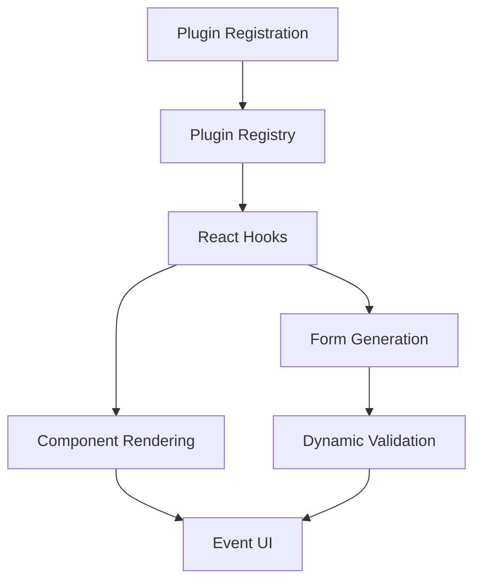

# Plugin System Technical Documentation
**Event Management Engine - Complete Developer Guide**

---

## 📋 **Table of Contents**

1. [Overview](#overview)
2. [Architecture](#architecture)
3. [Plugin Development Guide](#plugin-development-guide)
4. [Dynamic Form Builder](#dynamic-form-builder)
5. [API Reference](#api-reference)
6. [Best Practices](#best-practices)
7. [Troubleshooting](#troubleshooting)
8. [Examples](#examples)

---

## 🎯 **Overview**

Event Management Engine Plugin System memungkinkan developer untuk membuat event types yang berbeda (wedding, conference, birthday, dll.) dengan mudah melalui plugin architecture yang modular dan extensible.

### **Key Features:**
- 🔌 **Plugin-based Architecture** - Modular event type support
- 📋 **Dynamic Form Builder** - Automatic form generation dari plugin configuration
- ✅ **Advanced Validation** - Cross-field, async, dan conditional validation
- 🎨 **Theme System** - Plugin-specific theming support
- ⚛️ **React Integration** - Native React hooks dan components
- 🔄 **Lifecycle Hooks** - Event lifecycle management
- 📱 **TypeScript Support** - Full type safety

---

## 🏗️ **Architecture**

### **Core Components:**

```
📁 src/plugins/
├── 📄 types.ts              # Core interfaces dan types
├── 📄 registry.ts           # Plugin registration dan management
├── 📄 hooks.ts              # React hooks untuk plugin interaction
├── 📄 index.ts              # Central exports dan utilities
├── 📁 forms/                # Dynamic form system
│   ├── 📄 DynamicForm.tsx   # Main form component
│   ├── 📄 FormFieldBuilder.ts # Form field builder API
│   ├── 📄 FormValidationSystem.ts # Validation engine
│   └── 📄 index.ts          # Form system exports
└── 📁 wedding/              # Example wedding plugin
    └── 📄 WeddingPlugin.tsx  # Complete wedding implementation
```

### **Data Flow:**


---

## 🔌 **Plugin Development Guide**

### **1. Plugin Interface**

Setiap plugin harus mengimplementasikan interface `EventPlugin`:

```typescript
interface EventPlugin {
  // Plugin metadata
  type: string;                    // Unique identifier: 'wedding', 'conference'
  name: string;                    // Display name: 'Wedding Events'
  version: string;                 // Semantic version: '1.0.0'
  description: string;             // Plugin description
  
  // Component renderers
  renderHero(data: EventData, config: any): ReactNode;
  renderParticipants(data: EventData, config: any): ReactNode;
  renderDetails(data: EventData, config: any): ReactNode;
  renderStory?(data: EventData, config: any): ReactNode;        // Optional
  renderRegistration?(data: EventData, config: any): ReactNode; // Optional
  
  // Data management
  getDefaultSettings(): any;
  getFormFields(): FormField[];
  validateEventData(data: any): ValidationResult;
  
  // Lifecycle hooks (optional)
  onEventCreate?(data: EventData): Promise<void>;
  onEventUpdate?(data: EventData): Promise<void>;
  onEventDelete?(eventId: string): Promise<void>;
  
  // Theme support (optional)
  getAvailableThemes?(): ThemeConfig[];
  getDefaultTheme?(): string;
}
```

### **2. Creating Your First Plugin**

#### **Step 1: Define Plugin Structure**

```typescript
// src/plugins/conference/ConferencePlugin.tsx
import React from 'react';
import { EventPlugin, FormField, ValidationResult } from '../types';
import { FieldBuilder, PresetFields } from '../forms';

export const ConferencePlugin: EventPlugin = {
  type: 'conference',
  name: 'Conference Events',
  version: '1.0.0',
  description: 'Professional conference and seminar management',
  
  // Implementation methods...
};
```

#### **Step 2: Implement Form Fields**

```typescript
getFormFields(): FormField[] {
  return [
    // Basic event info
    ...PresetFields.eventName(),
    ...PresetFields.eventDate(),
    ...PresetFields.eventLocation(),
    
    // Conference-specific fields
    FieldBuilder.select('conferenceType')
      .label('Conference Type')
      .addOption('academic', 'Academic Conference')
      .addOption('business', 'Business Conference')
      .addOption('technology', 'Technology Summit')
      .required(true)
      .build(),
      
    FieldBuilder.number('maxAttendees')
      .label('Maximum Attendees')
      .placeholder('500')
      .custom(value => value > 0 && value <= 10000, 'Must be between 1-10,000')
      .build(),
      
    FieldBuilder.textarea('agenda')
      .label('Conference Agenda')
      .placeholder('Day 1: Opening ceremony...')
      .showWhenNotEquals('conferenceType', '')
      .build()
  ];
},
```

#### **Step 3: Implement Component Renderers**

```typescript
renderHero(data: EventData, config: any): ReactNode {
  return (
    <div className="conference-hero bg-gradient-to-r from-blue-600 to-purple-600 text-white">
      <div className="container mx-auto px-6 py-24 text-center">
        <h1 className="text-5xl font-bold mb-6">{data.title}</h1>
        <p className="text-xl mb-8">{data.description}</p>
        
        <div className="flex justify-center space-x-8 text-sm">
          <div className="bg-white/20 px-4 py-2 rounded-lg">
            📅 {new Date(data.start_date).toLocaleDateString()}
          </div>
          <div className="bg-white/20 px-4 py-2 rounded-lg">
            👥 {data.settings?.maxAttendees || 'TBD'} Attendees
          </div>
          <div className="bg-white/20 px-4 py-2 rounded-lg">
            🎯 {data.settings?.conferenceType || 'General'}
          </div>
        </div>
      </div>
    </div>
  );
},

renderParticipants(data: EventData, config: any): ReactNode {
  const speakers = data.participants?.filter(p => p.participant_type === 'speaker') || [];
  
  return (
    <section className="conference-speakers py-16 bg-gray-50">
      <div className="container mx-auto px-6">
        <h2 className="text-3xl font-bold text-center mb-12">Keynote Speakers</h2>
        
        <div className="grid md:grid-cols-3 gap-8">
          {speakers.map(speaker => (
            <div key={speaker.id} className="speaker-card bg-white p-6 rounded-lg shadow-lg">
              
              <h3 className="text-xl font-semibold text-center">{speaker.name}</h3>
              <p className="text-blue-600 text-center mb-3">{speaker.role}</p>
              <p className="text-gray-600 text-sm text-center">{speaker.bio}</p>
            </div>
          ))}
        </div>
      </div>
    </section>
  );
},
```

#### **Step 4: Add Validation Logic**

```typescript
validateEventData(data: any): ValidationResult {
  const errors: ValidationError[] = [];
  
  // Conference-specific validation
  if (data.conferenceType && data.conferenceType === 'academic') {
    if (!data.academicInstitution) {
      errors.push({
        field: 'academicInstitution',
        message: 'Academic institution required for academic conferences'
      });
    }
  }
  
  if (data.maxAttendees && data.maxAttendees > 5000) {
    if (!data.largeVenueConfirmed) {
      errors.push({
        field: 'largeVenueConfirmed',
        message: 'Large venue confirmation required for 5000+ attendees'
      });
    }
  }
  
  return {
    isValid: errors.length === 0,
    errors
  };
},
```

#### **Step 5: Register Plugin**

```typescript
// src/plugins/conference/index.ts
import { pluginRegistry } from '../registry';
import { ConferencePlugin } from './ConferencePlugin';

// Register plugin on import
pluginRegistry.register(ConferencePlugin);

export { ConferencePlugin };
```

```typescript
// src/plugins/index.ts - Add to central exports
export { ConferencePlugin } from './conference';
```

---

## 📋 **Dynamic Form Builder**

### **Form Field Types**

```typescript
type FieldType = 
  | 'text' | 'email' | 'number'     // Basic inputs
  | 'date' | 'datetime'             // Date/time inputs
  | 'textarea'                      // Multi-line text
  | 'select' | 'checkbox'           // Selection inputs
  | 'image';                        // File uploads
```

### **Field Builder API**

#### **Basic Field Creation**

```typescript
import { FieldBuilder } from '@/plugins/forms';

// Text field dengan validation
const nameField = FieldBuilder.text('participantName')
  .label('Participant Name')
  .placeholder('Enter full name')
  .required(true)
  .minLength(2, 'Name too short')
  .maxLength(100, 'Name too long')
  .build();

// Email field dengan custom validation
const emailField = FieldBuilder.email('contactEmail')
  .label('Contact Email')
  .placeholder('john@example.com')
  .required(true)
  .custom(
    value => !value.includes('temp'), 
    'Temporary emails not allowed'
  )
  .build();

// Select field dengan options
const typeField = FieldBuilder.select('eventType')
  .label('Event Type')
  .addOption('workshop', 'Workshop')
  .addOption('seminar', 'Seminar')
  .addOption('panel', 'Panel Discussion')
  .required(true)
  .build();
```

#### **Conditional Fields**

```typescript
// Show field only when condition met
const venueField = FieldBuilder.text('venueDetails')
  .label('Venue Details')
  .showWhenEquals('eventType', 'workshop')
  .build();

// Show field when NOT equal
const onlineField = FieldBuilder.text('meetingLink')
  .label('Online Meeting Link')
  .showWhenNotEquals('eventType', 'workshop')
  .build();

// Show when contains text
const specialField = FieldBuilder.textarea('specialRequirements')
  .label('Special Requirements')
  .showWhenContains('eventType', 'special')
  .build();
```

#### **Advanced Validation**

```typescript
// Custom validation dengan context
const budgetField = FieldBuilder.number('budget')
  .label('Event Budget')
  .custom((value, context) => {
    const eventType = context.formData.eventType;
    const minBudget = eventType === 'conference' ? 10000 : 1000;
    return value >= minBudget;
  }, 'Budget too low for this event type')
  .build();

// Pattern validation
const phoneField = FieldBuilder.text('phoneNumber')
  .label('Phone Number')
  .pattern('^(08|\\+628)[0-9]{8,11}$', 'Invalid Indonesian phone number')
  .build();
```

### **Form Layouts**

```typescript
import { FormLayout } from '@/plugins/forms';

// Two-column layout
const fields = FormLayout.twoColumns([
  nameField,
  emailField,
  phoneField,
  addressField
]);

// Sectioned layout
const sectionedFields = [
  ...FormLayout.section('Basic Information', [
    nameField,
    emailField,
    phoneField
  ]),
  ...FormLayout.section('Event Details', [
    eventTypeField,
    venueField,
    dateField
  ])
];
```

### **Using Dynamic Forms**

```tsx
import React from 'react';
import { DynamicForm } from '@/plugins/forms';

function EventCreationForm({ eventType }: { eventType: string }) {
  const fields = getPresetFieldsForEventType(eventType);
  
  const handleSubmit = (data: Record<string, any>, isValid: boolean) => {
    if (isValid) {
      // Save event data
      console.log('Event data:', data);
    }
  };
  
  const handleValidate = (data: Record<string, any>) => {
    // Custom validation logic
    return { isValid: true, errors: [] };
  };
  
  return (
    <DynamicForm
      fields={fields}
      onSubmit={handleSubmit}
      onValidate={handleValidate}
      submitText="Create Event"
      className="max-w-2xl mx-auto"
    />
  );
}
```

---

## ⚛️ **React Hooks API**

### **usePlugin Hook**

```tsx
import { usePlugin } from '@/plugins/hooks';

function EventDisplay({ eventType }: { eventType: string }) {
  const { plugin, isLoading, error, reload } = usePlugin(eventType);
  
  if (isLoading) return <div>Loading plugin...</div>;
  if (error) return <div>Error: {error.message}</div>;
  if (!plugin) return <div>Plugin not found</div>;
  
  return (
    <div>
      <h1>{plugin.name} v{plugin.version}</h1>
      <button onClick={reload}>Reload Plugin</button>
    </div>
  );
}
```

### **usePluginManager Hook**

```tsx
import { usePluginManager } from '@/plugins/hooks';

function PluginDashboard() {
  const { plugins, activePlugins, loadPlugin, unloadPlugin, isPluginActive } = usePluginManager();
  
  return (
    <div>
      <h2>Available Plugins</h2>
      {Object.values(plugins).map(plugin => (
        <div key={plugin.type} className="plugin-item">
          <span>{plugin.name}</span>
          <span>{isPluginActive(plugin.type) ? '✅ Active' : '❌ Inactive'}</span>
          <button 
            onClick={() => isPluginActive(plugin.type) 
              ? unloadPlugin(plugin.type) 
              : loadPlugin(plugin.type)
            }
          >
            {isPluginActive(plugin.type) ? 'Unload' : 'Load'}
          </button>
        </div>
      ))}
    </div>
  );
}
```

### **usePluginRenderer Hook**

```tsx
import { usePluginRenderer } from '@/plugins/hooks';

function EventHero({ eventType, eventData }: { eventType: string, eventData: any }) {
  const { renderComponent, isReady } = usePluginRenderer(eventType, 'hero');
  
  if (!isReady) return <div>Loading...</div>;
  
  return (
    <div className="event-hero">
      {renderComponent(eventData, { theme: 'modern' })}
    </div>
  );
}
```

### **usePluginFormFields Hook**

```tsx
import { usePluginFormFields } from '@/plugins/hooks';

function EventForm({ eventType }: { eventType: string }) {
  const { formFields, defaultSettings, validateEventData, isReady } = usePluginFormFields(eventType);
  
  if (!isReady) return <div>Loading form...</div>;
  
  const handleSubmit = (data: Record<string, any>) => {
    const validation = validateEventData(data);
    if (validation.isValid) {
      // Process form data
    }
  };
  
  return (
    <DynamicForm 
      fields={formFields}
      initialValues={defaultSettings}
      onSubmit={handleSubmit}
    />
  );
}
```

---

## 🎨 **Theme System**

### **Defining Themes in Plugin**

```typescript
getAvailableThemes(): ThemeConfig[] {
  return [
    {
      id: 'professional',
      name: 'Professional',
      description: 'Clean and modern design for business events',
      colors: {
        primary: '#2563eb',
        secondary: '#64748b',
        accent: '#0ea5e9',
        background: '#ffffff',
        text: '#1f2937'
      },
      fonts: {
        heading: 'Inter, sans-serif',
        body: 'Inter, sans-serif'
      },
      layout: {
        container_width: '1200px',
        spacing: '1.5rem',
        border_radius: '8px'
      }
    },
    {
      id: 'creative',
      name: 'Creative',
      description: 'Bold and colorful design for creative events',
      colors: {
        primary: '#7c3aed',
        secondary: '#a855f7',
        accent: '#ec4899',
        background: '#faf5ff',
        text: '#374151'
      }
      // ... more theme properties
    }
  ];
}
```

### **Using Themes in Components**

```tsx
renderHero(data: EventData, config: any): ReactNode {
  const theme = config.theme || this.getDefaultTheme();
  
  return (
    <div 
      className="event-hero" 
      style={{
        backgroundColor: theme.colors.primary,
        color: theme.colors.text,
        fontFamily: theme.fonts.heading
      }}
    >
      <h1>{data.title}</h1>
    </div>
  );
}
```

---

## 📚 **Best Practices**

### **1. Plugin Development**

#### ✅ **Do:**
```typescript
// Clear, descriptive plugin metadata
export const ConferencePlugin: EventPlugin = {
  type: 'conference',              // Lowercase, no spaces
  name: 'Conference Events',       // Human-readable name
  version: '1.0.0',               // Semantic versioning
  description: 'Professional conference management with speaker tracking',
  
  // Always provide fallbacks
  renderHero(data, config = {}) {
    return data ? <ConferenceHero data={data} config={config} /> : <div>No data</div>;
  }
};
```

#### ❌ **Don't:**
```typescript
// Vague or inconsistent metadata
export const MyPlugin: EventPlugin = {
  type: 'Conference Event',        // ❌ Spaces in type
  name: 'conf',                    // ❌ Too short
  version: '1',                    // ❌ Not semantic versioning
  description: '',                 // ❌ Empty description
  
  // No error handling
  renderHero(data) {
    return <div>{data.title}</div>; // ❌ Could crash if data is null
  }
};
```

### **2. Form Field Design**

#### ✅ **Do:**
```typescript
// Clear labels and helpful placeholders
FieldBuilder.text('organizerName')
  .label('Event Organizer Name')
  .placeholder('Enter full name of the person organizing this event')
  .helpText('This will be displayed publicly on the event page')
  .required(true)
  .minLength(2, 'Name must be at least 2 characters')
  .build();
```

#### ❌ **Don't:**
```typescript
// Vague labels and no validation
FieldBuilder.text('org')           // ❌ Unclear field name
  .label('Org')                    // ❌ Unclear label
  .build();                        // ❌ No validation
```

### **3. Component Rendering**

#### ✅ **Do:**
```typescript
renderParticipants(data: EventData, config: any): ReactNode {
  if (!data?.participants?.length) {
    return (
      <section className="no-participants">
        <p>No participants registered yet.</p>
        <button>Register Now</button>
      </section>
    );
  }
  
  return (
    <section className="participants">
      {data.participants.map(participant => (
        <ParticipantCard key={participant.id} participant={participant} />
      ))}
    </section>
  );
}
```

#### ❌ **Don't:**
```typescript
renderParticipants(data: EventData, config: any): ReactNode {
  // ❌ No null checking, could crash
  return (
    <section>
      {data.participants.map(participant => (
        <div>{participant.name}</div>  // ❌ Missing key prop
      ))}
    </section>
  );
}
```

### **4. Performance Optimization**

```typescript
// Use React.memo untuk expensive components
const ConferenceHero = React.memo(({ data, config }: { data: EventData, config: any }) => {
  const memoizedTheme = useMemo(() => processTheme(config.theme), [config.theme]);
  
  return <div style={memoizedTheme}>{/* Hero content */}</div>;
});

// Lazy load plugin components
const LazyConferenceDetails = React.lazy(() => import('./ConferenceDetails'));
```

---

## 🔧 **Troubleshooting**

### **Common Issues**

#### **1. Plugin Not Loading**

**Problem:** Plugin tidak muncul dalam registry

**Solution:**
```typescript
// Pastikan plugin di-register
import { pluginRegistry } from '@/plugins/registry';
import { MyPlugin } from './MyPlugin';

pluginRegistry.register(MyPlugin);  // ✅ Register plugin

// Check registration status
console.log('Registered plugins:', pluginRegistry.getAllPlugins());
```

#### **2. Form Validation Errors**

**Problem:** Form validation tidak berfungsi

**Solution:**
```typescript
// Pastikan validation rules benar
const field = FieldBuilder.text('email')
  .label('Email')
  .email('Invalid email format')     // ✅ Built-in validation
  .custom(value => {                 // ✅ Custom validation
    return value.includes('@company.com');
  }, 'Must use company email')
  .build();
```

#### **3. TypeScript Errors**

**Problem:** Type errors saat develop plugin

**Solution:**
```typescript
// Import proper types
import { EventPlugin, EventData, FormField, ValidationResult } from '@/plugins/types';

// Implement all required methods
export const MyPlugin: EventPlugin = {
  // All required properties...
  
  validateEventData(data: any): ValidationResult {  // ✅ Proper return type
    return {
      isValid: true,
      errors: []
    };
  }
};
```

#### **4. Component Rendering Issues**

**Problem:** Components tidak render dengan benar

**Solution:**
```typescript
// Always import React
import React from 'react';

// Provide fallback renderers
renderHero(data: EventData, config: any): ReactNode {
  if (!data) {
    return <div>Loading event data...</div>;
  }
  
  try {
    return <MyHeroComponent data={data} config={config} />;
  } catch (error) {
    console.error('Hero render error:', error);
    return <div>Error loading event hero</div>;
  }
}
```

---

## 📖 **Complete Examples**

### **Example 1: Simple Birthday Plugin**

```typescript
// src/plugins/birthday/BirthdayPlugin.tsx
import React from 'react';
import { EventPlugin, EventData, FormField, ValidationResult } from '../types';
import { FieldBuilder, PresetFields } from '../forms';

export const BirthdayPlugin: EventPlugin = {
  type: 'birthday',
  name: 'Birthday Celebrations',
  version: '1.0.0',
  description: 'Fun and festive birthday party management',
  
  getDefaultSettings() {
    return {
      partyTheme: 'colorful',
      allowGifts: true,
      maxGuests: 50
    };
  },
  
  getFormFields(): FormField[] {
    return [
      // Basic event info
      PresetFields.eventName(),
      PresetFields.eventDate(),
      PresetFields.eventLocation(),
      
      // Birthday-specific fields
      FieldBuilder.text('celebrantName')
        .label('Birthday Person')
        .placeholder('Who is celebrating?')
        .required(true)
        .build(),
        
      FieldBuilder.number('age')
        .label('Age')
        .placeholder('25')
        .custom(value => value > 0 && value < 150, 'Please enter a valid age')
        .build(),
        
      FieldBuilder.select('partyTheme')
        .label('Party Theme')
        .addOption('colorful', 'Colorful & Fun')
        .addOption('elegant', 'Elegant')
        .addOption('casual', 'Casual')
        .addOption('surprise', 'Surprise Party')
        .defaultValue('colorful')
        .build(),
        
      FieldBuilder.checkbox('allowGifts')
        .label('Gift Registry Available')
        .defaultValue(true)
        .build()
    ];
  },
  
  validateEventData(data: any): ValidationResult {
    const errors = [];
    
    // Validate age for surprise parties
    if (data.partyTheme === 'surprise' && !data.secretContact) {
      errors.push({
        field: 'secretContact',
        message: 'Secret contact required for surprise parties'
      });
    }
    
    return { isValid: errors.length === 0, errors };
  },
  
  renderHero(data: EventData, config: any) {
    return (
      <div className="birthday-hero bg-gradient-to-r from-pink-400 to-purple-500 text-white">
        <div className="container mx-auto px-6 py-20 text-center">
          <div className="text-6xl mb-4">🎉</div>
          <h1 className="text-4xl font-bold mb-4">
            {data.settings?.celebrantName}'s Birthday!
          </h1>
          <p className="text-xl mb-6">
            Turning {data.settings?.age || '??'} on {new Date(data.start_date).toLocaleDateString()}
          </p>
          <div className="inline-block bg-white/20 px-6 py-3 rounded-full">
            🎂 Join us for the celebration!
          </div>
        </div>
      </div>
    );
  },
  
  renderParticipants(data: EventData, config: any) {
    const guests = data.participants || [];
    
    return (
      <section className="birthday-guests py-16">
        <div className="container mx-auto px-6">
          <h2 className="text-3xl font-bold text-center mb-12">Party Guests</h2>
          
          {guests.length === 0 ? (
            <p className="text-center text-gray-500">No guests registered yet. Be the first!</p>
          ) : (
            <div className="grid md:grid-cols-4 gap-6">
              {guests.map(guest => (
                <div key={guest.id} className="guest-card text-center p-4 bg-pink-50 rounded-lg">
                  <div className="text-2xl mb-2">🎈</div>
                  <h3 className="font-semibold">{guest.name}</h3>
                  {guest.role && <p className="text-sm text-pink-600">{guest.role}</p>}
                </div>
              ))}
            </div>
          )}
        </div>
      </section>
    );
  },
  
  renderDetails(data: EventData, config: any) {
    return (
      <section className="birthday-details py-16 bg-gray-50">
        <div className="container mx-auto px-6">
          <div className="max-w-3xl mx-auto">
            <h2 className="text-3xl font-bold text-center mb-12">Party Details</h2>
            
            <div className="grid md:grid-cols-2 gap-8">
              <div className="detail-card bg-white p-6 rounded-lg shadow">
                <h3 className="text-xl font-semibold mb-3 text-pink-600">🎂 Celebration Info</h3>
                <p><strong>Celebrant:</strong> {data.settings?.celebrantName}</p>
                <p><strong>Age:</strong> {data.settings?.age}</p>
                <p><strong>Theme:</strong> {data.settings?.partyTheme}</p>
                <p><strong>Date:</strong> {new Date(data.start_date).toLocaleDateString()}</p>
              </div>
              
              <div className="detail-card bg-white p-6 rounded-lg shadow">
                <h3 className="text-xl font-semibold mb-3 text-purple-600">🎁 Gift Registry</h3>
                {data.settings?.allowGifts ? (
                  <p>Gift registry is available! Contact the host for details.</p>
                ) : (
                  <p>No gifts please - your presence is the best present! 🎉</p>
                )}
              </div>
            </div>
            
            {data.description && (
              <div className="mt-8 bg-white p-6 rounded-lg shadow">
                <h3 className="text-xl font-semibold mb-3">About the Celebration</h3>
                <p className="text-gray-700">{data.description}</p>
              </div>
            )}
          </div>
        </div>
      </section>
    );
  },
  
  getAvailableThemes() {
    return [
      {
        id: 'colorful',
        name: 'Colorful Fun',
        description: 'Bright and cheerful colors',
        colors: {
          primary: '#ff6b9d',
          secondary: '#feca57',
          accent: '#48dbfb',
          background: '#ffffff',
          text: '#2d3436'
        },
        fonts: {
          heading: 'Comic Neue, cursive',
          body: 'Open Sans, sans-serif'
        },
        layout: {
          container_width: '1100px',
          spacing: '2rem',
          border_radius: '12px'
        }
      }
    ];
  },
  
  getDefaultTheme() {
    return 'colorful';
  }
};
```

### **Example 2: Using the Birthday Plugin**

```tsx
// components/BirthdayEventPage.tsx
import React from 'react';
import { usePlugin, usePluginRenderer } from '@/plugins/hooks';

interface BirthdayEventPageProps {
  eventId: string;
  eventData: EventData;
}

export function BirthdayEventPage({ eventId, eventData }: BirthdayEventPageProps) {
  const { plugin, isLoading, error } = usePlugin('birthday');
  const heroRenderer = usePluginRenderer('birthday', 'hero');
  const participantsRenderer = usePluginRenderer('birthday', 'participants');
  const detailsRenderer = usePluginRenderer('birthday', 'details');
  
  if (isLoading) return <div>Loading birthday plugin...</div>;
  if (error) return <div>Error: {error.message}</div>;
  if (!plugin) return <div>Birthday plugin not found</div>;
  
  const themeConfig = { theme: plugin.getDefaultTheme() };
  
  return (
    <div className="birthday-event-page">
      {/* Hero Section */}
      {heroRenderer.renderComponent(eventData, themeConfig)}
      
      {/* Participants Section */}
      {participantsRenderer.renderComponent(eventData, themeConfig)}
      
      {/* Details Section */}
      {detailsRenderer.renderComponent(eventData, themeConfig)}
      
      {/* Registration Form */}
      <section className="py-16">
        <div className="container mx-auto px-6">
          <h2 className="text-3xl font-bold text-center mb-12">RSVP for the Party</h2>
          <BirthdayRegistrationForm eventId={eventId} />
        </div>
      </section>
    </div>
  );
}
```

---

**Documentation Version:** 1.0.0  
**Last Updated:** 2025-01-13  
**Compatibility:** Event Management Engine v2.0+

---

*For more examples and advanced usage patterns, visit our [GitHub repository](https://github.com/your-org/event-management-engine) or contact the development team.*